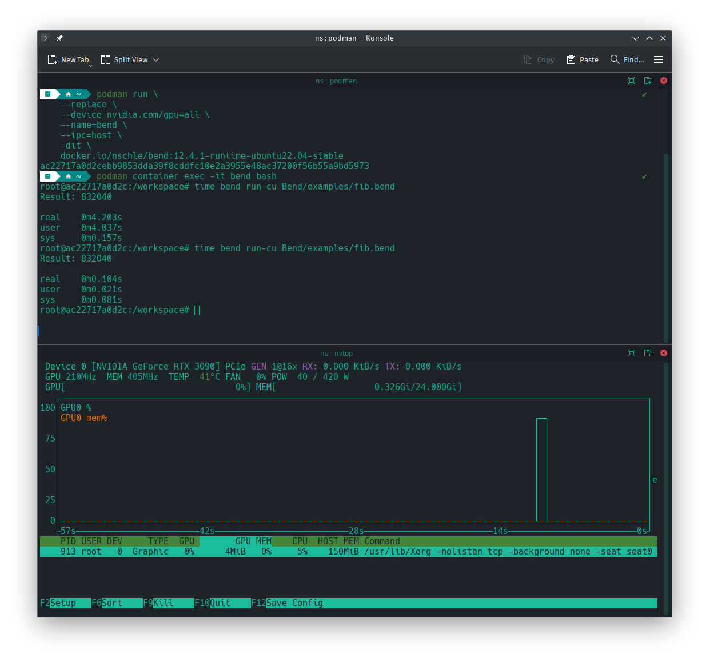

# podman_build_bend

This repo contains scripts for building images of [HigherOrderCO](https://github.com/HigherOrderCO)'s [HVM](https://github.com/HigherOrderCO/HVM) and [Bend](https://github.com/HigherOrderCO/Bend/).

The goal is to create an isolated, permanently running, CUDA-enabled environment accessible for interactive use of Bend. Example commands can be found at the end of this document.

## Disclaimer and Scope

To use CUDA functions of this image and to follow the example, it's required to run the image on a working Docker or podman setup, which has access to an Nvidia GPU. The image has been used successfully on Linux 6.6.32 using glibc.

## Tags

The workflows of this repo push their tags to this [Docker Hub repo](https://hub.docker.com/repository/docker/nschle/bend/).

### Stable Image

If you want to try out HVM and Bend.

* `docker pull docker.io/nschle/bend:12.4.1-runtime-ubuntu22.04-stable`
    * built with crates.io versions of HVM and Bend
    * this image contains the HVM and Bend versions considered stable by the developers
    * [](https://github.com/Wolfsauge/podman_build_bend/actions/workflows/docker-image-ci-stable.yaml) 

### Devel Image

If you are missing nvcc to compile CUDA binaries, use this image.

* `docker pull docker.io/nschle/bend:12.4.1-devel-ubuntu22.04-devel`
   * built with crates.io versions of HVM and Bend
   * this image contains the HVM and Bend versions considered stable by the developers
   * additionally nvcc is contained
   * bigger image: ~ 4.3 GB compressed
   * [](https://github.com/Wolfsauge/podman_build_bend/actions/workflows/docker-image-ci-devel.yaml)   

### Latest Image
* `docker pull docker.io/nschle/bend:12.4.1-runtime-ubuntu22.04-latest`
    * built with the latest git versions of HVM and Bend
    * [](https://github.com/Wolfsauge/podman_build_bend/actions/workflows/docker-image-ci-latest.yaml) 

### Build Notes

* based on the CUDA Ubuntu images provided by [Nvidia](https://hub.docker.com/r/nvidia/cuda)
   * docker.io/nvidia/cuda:12.4.1-devel-ubuntu22.04 `sha256:5645fec64549cc35930eee9d85aafd2b0006c0c3f22632be5a1d85e2604e9749`
   * docker.io/nvidia/cuda:12.4.1-runtime-ubuntu22.04 `sha256:cff3a0d82d2c2b47bab252d67fa9b34a20ef4c50781d98501b5c7367ea9afd10`
* nvcc _not_ included in the images, except the devel image
* aiming to produce small images: ~ 2.6 GB compressed
* two-stage build process:
    1. hvm and bend-lang built with CUDA devel image
    2. build artifacts then copied to CUDA runtime image
* SBOM created with syft
* provenance attestation manifests attached

### Image Customizations

* Yelp's [dumb-init](https://github.com/Yelp/dumb-init) for signal handling and orphan reaping
* latest Ubuntu updates installed at image build time
* latest git clones of HVM and Bend GitHub repositories created at image build time
* tools typically needed for running on rented GPU nodes, compression tools and text editors
* rsync, ssh, tmux, zsh and git
* build-essential
* rustup + rust nightly
* hvm and bend-lang

## Example Usage

The following commands will run the stable image using podman (version 5.0.3) and GPU. With older versions of podman the syntax to use a GPU might be different, `--gpus all` instead of `--device nvidia.com/gpu=all`.

```shell
podman run \
    --replace \
    --device nvidia.com/gpu=all \
    --name=bend \
    --ipc=host \
    -dit \
    docker.io/nschle/bend:12.4.1-runtime-ubuntu22.04-stable
```

```shell
podman container exec -it bend bash 
```
## Comparing Results

Once inside the _stable_ container, running the `fib.bend` example twice looks like this on a RTX 3090, Intel 12900K, DDR4 system.

```shell
$ podman container exec -it bend bash
root@ac22717a0d2c:/workspace# time bend run-cu Bend/examples/fib.bend 
Result: 832040

real    0m4.203s
user    0m4.037s
sys     0m0.157s
root@ac22717a0d2c:/workspace# time bend run-cu Bend/examples/fib.bend 
Result: 832040

real    0m0.104s
user    0m0.021s
sys     0m0.081s
root@ac22717a0d2c:/workspace#
```



Last changed: 2024-05-29, Wolfsauge
